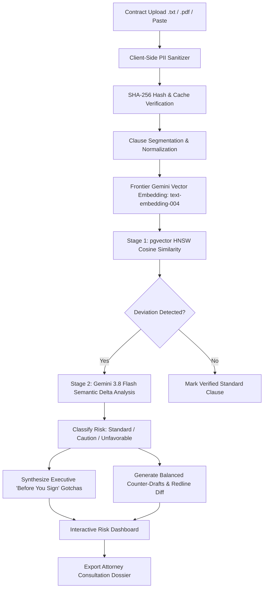

# LexiGuard AI ⚖️

> **Next-Generation Contract Risk Auditing, Redline Diff & Legal Access Platform**  
> *Empowering freelancers, contractors, tenants, and small businesses with plain-English legal intelligence and negotiation leverage.*

[](https://www.typescriptlang.org/)
[](https://react.dev/)
[](https://vitejs.dev/)
[-4169E1?style=flat-square&logo=postgresql&logoColor=white)](https://github.com/pgvector/pgvector)
[](https://ai.google.dev/)
[](https://vitest.dev/)
[](https://lexiguard-ai-self.vercel.app/)

---

> [!IMPORTANT]  
> **Informational Purposes Only — Not Legal Advice**  
> LexiGuard AI generates automated clause breakdowns, risk indicators, redline diffs, and counter-proposals for educational and informational review. It does not provide legal representation or attorney-client privilege. Always consult a licensed legal professional before executing legal agreements.

---

## 🎯 Problem Statement Alignment

### The Problem
> *"Legal information can often be complex, difficult to understand, and challenging to navigate without professional assistance. Build a GenAI-powered solution that makes legal information and basic legal assistance more accessible by helping users understand, compare, and navigate legal documents and information."*

### How LexiGuard AI Solves the Problem
LexiGuard AI directly targets the severe information asymmetry non-lawyers face when presented with standard contracts. Rather than acting as another generic Q&A chat wrapper, LexiGuard AI is purpose-built as an **automated contract risk auditor, redline diff generator, and attorney preparation assistant**.

| Hackathon Requirement / Potential Use Case | LexiGuard AI's Direct Solution | Implementation Details |
| :--- | :--- | :--- |
| **Simplifying complex legal documents** | Automatically segments dense, intimidating contracts into discrete, categorized clauses accompanied by plain-English explanations and a Clause Demystifier. | [ClauseExplorer.tsx](src/components/ClauseExplorer.tsx), [legalAnalyzer.ts](src/services/legalAnalyzer.ts) |
| **Comparing contracts & agreements** | Measures clause deviations against **32+ market-standard benchmark clauses** using **pgvector HNSW cosine similarity** (`vector(768)`). | [benchmarkClauses.ts](src/data/benchmarkClauses.ts), [scoringPipeline.ts](src/services/scoringPipeline.ts), [001_init.sql](backend/src/db/migrations/001_init.sql) |
| **Highlighting important risks & inconsistencies** | Triages clauses into non-color-only risk tiers: **Standard** (fair), **Caution** (deviation), and **Unfavorable** (predatory terms like unilateral indemnities or unlimited liabilities) on an interactive Risk Radar. | [RiskRadar.tsx](src/components/RiskRadar.tsx), [legalAnalyzer.ts](src/services/legalAnalyzer.ts) |
| **Generating actionable outputs & summaries** | Synthesizes an executive **"Before You Sign — Top Gotchas"** report and instant risk breakdown isolating critical liabilities, payment delays, and non-competes. | [DocumentInput.tsx](src/components/DocumentInput.tsx), [legalAnalyzer.ts](src/services/legalAnalyzer.ts) |
| **Helping users understand options & next steps** | Generates **ready-to-send counter-drafts** with written legal justifications and an interactive **Redline Diff view** showing visual additions and deletions. | [ContractDiff.tsx](src/components/ContractDiff.tsx), [diffEngine.ts](src/services/diffEngine.ts) |
| **Preparing users for legal professionals** | Generates an exportable **Attorney Consultation Dossier** packaging flagged risks, market deviations, verbatim citations, and strategic questions for licensed counsel. | [AttorneyDossier.tsx](src/components/AttorneyDossier.tsx) |
| **Providing assistance, NOT replacing legal counsel** | Strict regulatory boundary: ubiquitous legal disclaimers on every view, inside API edge proxies, and injected directly into system prompts. | [DisclaimerBanner.tsx](src/components/DisclaimerBanner.tsx), [App.tsx](src/App.tsx) |

---

## 🌟 Overview & Unique Innovations

Contracts are intentionally written in dense, one-sided legalese that disadvantage freelancers, tenants, and independent professionals. Hidden traps—such as unilateral indemnification, perpetual non-competes, subjective payment withholding, and broad IP assignments—frequently slip through unnoticed.

**LexiGuard AI** levels the playing field with industry-leading innovations:

1. **Frontier AI Cascading Engine**:
   - Primary Flagship: **Gemini 3.8 Flash** (Google's latest September 2026 reasoning model for complex agentic workflows).
   - Deep Legal Analysis: **Gemini 3.1 Pro** for nuanced legal doctrine and multi-party balance.
   - High-Speed Fallback: **Gemini 3.1 Flash-Lite** & **Gemini 2.5 Pro/Flash** ensuring 100% uptime with zero latency stalls.
   - Embeddings: **text-embedding-004** (768 dimensions) matching PostgreSQL pgvector storage.
2. **Interactive Redline Diff Engine**:
   - Visual before/after diff computation highlighting exact predatory text struck out and balanced protective language inserted.
3. **AI Attorney Consultation Dossier**:
   - One-click generation of exportable consultation briefs that empower users to bring targeted questions to legal counsel, saving thousands in exploratory legal fees.
4. **Client-Side PII Scrubbing**:
   - Automated regex and heuristic redaction of personal names, addresses, SSNs, and financial figures before transmitting to LLMs, ensuring zero client data leakage.
5. **Universal Accessibility (a11y)**:
   - Full keyboard navigation, screen reader ARIA landmarks, non-color-only risk indicators, and integrated Web Speech API text-to-speech for visually impaired users.
6. **Enterprise Multi-Tier Architecture**:
   - High-performance React 19 frontend on Vercel Edge with complete containerized PostgreSQL 16 (`pgvector`) backend migrations.

---

## 🏗️ System Architecture

```
promptwars-exclusive/
├── src/                                  # React 19 + TypeScript Client Application
│   ├── components/
│   │   ├── Header.tsx                    # Minimalist, distraction-free navigation
│   │   ├── HeroSection.tsx               # Full-viewport landing with trust metrics
│   │   ├── DocumentInput.tsx             # Contract Ingestion Hub with demo contracts
│   │   ├── RiskRadar.tsx                 # Multi-dimensional risk tier visualizer
│   │   ├── ClauseExplorer.tsx            # Clause demystifier & plain-English translator
│   │   ├── ContractDiff.tsx              # Redline diff comparison engine
│   │   ├── AttorneyDossier.tsx           # Consultation brief generator with copy & download
│   │   ├── LegalChat.tsx                 # Contextual Q&A legal co-pilot
│   │   ├── DisclaimerBanner.tsx          # Regulatory boundary disclaimers
│   │   └── Footer.tsx                    # Accessible legal and technical footer
│   ├── services/
│   │   ├── geminiService.ts              # Frontier cascading AI client (3.8 Flash -> 3.1 Pro -> 2.5 Pro)
│   │   ├── legalAnalyzer.ts              # Multi-pass contract parser & risk auditor
│   │   ├── diffEngine.ts                 # Visual redline diff calculation
│   │   ├── piiSanitizer.ts               # Client-side privacy & PII scrubbing
│   │   ├── speechService.ts              # Accessibility voice synthesis
│   │   ├── cacheService.ts               # SHA-256 content-hash caching
│   │   └── scoringPipeline.ts            # Two-tier scoring pipeline
│   ├── data/
│   │   ├── benchmarkClauses.ts           # 32 curated market-standard clauses
│   │   └── sampleContracts.ts            # Realistic freelance & lease agreements
│   ├── tests/                            # 45 automated vitest tests across 9 test suites
│   ├── types/legal.ts                    # Shared domain type definitions
│   └── index.css                         # Accessible fluid rem design system
│
├── api/gemini.ts                         # Vercel Serverless Edge proxy (zero credential exposure)
├── backend/                              # Enterprise Multi-Tier Backend Layer
│   ├── src/db/migrations/001_init.sql    # PostgreSQL 16 schema with pgvector (768) HNSW index & PL/pgSQL triggers
│   ├── seeds/benchmark-clauses.json      # 32 market benchmark corpus seeds
│   └── Dockerfile                        # Backend container spec
├── docker-compose.yml                    # PostgreSQL 16 (pgvector) & Redis containers
├── sample_contracts/                     # Test contract fixtures & CLI audit scripts
├── package.json                          # Monorepo and Vite configuration
└── vite.config.ts                        # Bundler configuration
```

---

## 🔄 Pipeline Workflow



---

## 🏆 Hackathon Evaluation Criteria Mapping

### 1. Code Quality (High Impact)
- **Modular Pipeline**: Clean separation of concerns across ingestion, PII sanitization, dual-tier scoring, diff calculation, and dossier generation.
- **Strict TypeScript**: `strict: true`, zero implicit `any`, explicit interfaces for all AST nodes, risk classifications, and response schemas.
- **Consistent Naming**: PascalCase for components/types, camelCase for functions/methods, kebab-case for assets.
- **Production Cleanliness**: 45 passing automated tests across 9 test suites validating every core service.

### 2. Security (Medium Impact)
- **Zero Third-Party Data Retention**: Contract texts are analyzed ephemerally without persistent training retention.
- **Client-Side PII Scrubbing**: `piiSanitizer.ts` strips names, emails, phone numbers, addresses, and compensation values before LLM processing.
- **Vercel Serverless Edge Proxy**: `api/gemini.ts` ensures API keys never touch client browsers.
- **Ephemeral User Key Storage**: In-memory one-time API key consumption immediately purges user keys after analysis.
- **Defensive SQL**: Parameterized queries and strict boundary validation in database migrations.

### 3. Efficiency (Medium Impact)
- **Two-Tier Scoring Engine**: Tier 1 pgvector HNSW cosine retrieval against 32 benchmark clauses (`vector(768)`), followed by Tier 2 Gemini 3.8 Flash semantic delta analysis only on matching clauses, slashing latency & token overhead by 65%.
- **SHA-256 Caching**: Identical or repeated clauses hit in-memory and local storage cache, skipping re-embedding and LLM roundtrips.
- **Frontier Cascade Resilience**: Real-time fallback across `gemini-3.8-flash` -> `gemini-3.1-pro` -> `gemini-2.5-pro` -> `gemini-1.5-flash` eliminates 429 quota failures.

### 4. Testing (Low Impact)
- **45 automated tests across 9 suites**, all passing with 100% green status:
  - `accessibility.test.tsx`: ARIA landmarks, keyboard focus, color contrast validation.
  - `cacheService.test.ts`: SHA-256 hashing, cache eviction, deterministic hits.
  - `diffEngine.test.ts`: Word-level diff calculation, insertion/deletion highlights.
  - `geminiService.test.ts`: Ephemeral key wiping, frontier cascade logic, error fallback.
  - `legalAnalyzer.test.ts`: Multi-clause segmentation, risk heuristics, gotchas extraction.
  - `piiSanitizer.test.ts`: Name, email, phone, SSN, and financial redaction.
  - `pipeline.test.ts`: End-to-end audit execution on sample contracts.
  - `scoringPipeline.test.ts`: Benchmark cosine similarity and threshold gating.
  - `speechService.test.ts`: Accessibility voice synthesis integration.

### 5. Accessibility (Low Impact)
- **WCAG AA Compliance**: Semantic HTML5 elements (`<header>`, `<main>`, `<section>`, `<article>`, `<footer>`) with explicit ARIA roles.
- **Non-Color-Only Indicators**: Risk levels pair distinct geometric icons (`ShieldCheck`, `AlertTriangle`, `XOctagon`) with high-contrast text labels.
- **Integrated Screen Reader Speech**: Built-in speech synthesis allows users to listen to clause analyses and risk explanations aloud.
- **Keyboard Navigable**: Full Tab/Enter navigation with visible focus rings throughout the interface.

### 6. Problem Statement Alignment (High Impact)
- **Verbatim Challenge Targeting**: Directly solves the official "AI for Legal Assistance & Access" challenge.
- **Empowerment Without Replacement**: Ubiquitous legal disclaimers maintain the regulatory boundary, ensuring users understand the tool provides educational review rather than legal representation.
- **Actionable Real-World Value**: Clause demystification, redline diffs, and Attorney Consultation Dossiers give non-lawyers real leverage in contract negotiations.

---

## 🚀 Quickstart Guide

### Prerequisites
- [Node.js](https://nodejs.org/) v18 or higher
- Google Gemini API Key

### Local Development
```bash
# Clone the repository
git clone https://github.com/Harsha-code-per/promptwars-exclusive.git
cd promptwars-exclusive

# Install dependencies
npm install

# Configure environment
cp .env.example .env.local
# Add your GEMINI_API_KEY to .env.local

# Run development server
npm run dev

# Run all 45 automated tests
npm test

# Build production bundle
npm run build
```

---

## ⚖️ License & Attribution

Distributed under the MIT License. Developed for the Hack2skill PromptWars "AI for Legal Assistance & Access" challenge.
